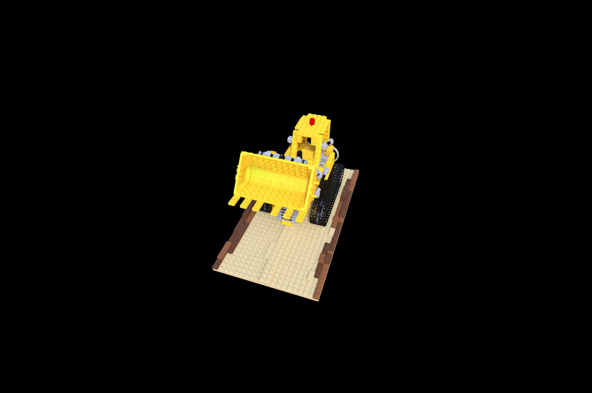
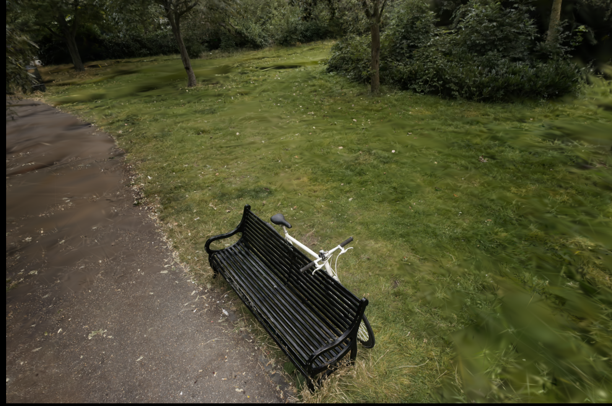

# LuisaComputeGaussianSplatting

## How to start

- get the ply file from Release
  - mip360_bicycle
  - nerf_blender_lego
- generate [LuisaCompute](https://github.com/LuisaGroup/LuisaCompute) Path
  - create `.env` file by copy `.env.template` file, and modify the `LC_DIR` and `LC_XREPO_DIR` to the LuisaCompute path on your machine
  - `xmake l setup.lua` to generate `lc_options.generated.lua`
- build 
  - `xmake` 
- run
  - `xmake run lcgs-app --ply=<path_to_your_ply> --backend=<dx/cuda/...> --out=<dir_to_your_out_img>`
  - an extra optional arg is `--world`, you can choose blender or colmap, the colmap scene has its default up vector (0, -1, 0) and the blender scenes assuming up vector (0, 0, 1). we assume colmap by default.
  - e.g. `xmake run lcgs-app --ply="D:\ws\data\pretrained\gaussian\nerf_blender_chair_30000.ply" --out=D:/ws/data/mid/lcgs/ --backend=dx --world=blender`
  - e.g. `xmake run lcgs-app --ply="D:\ws\data\pretrained\gaussian\mip360_bicycle_30000.ply" --out=D:/ws/data/mid/lcgs/ --backend=dx`
  - then you can check `<dir_to_your_out_img>` with `<ply_name>_<dx/cuda...>.png` for the result, e.g. `mip360_bicycle_30000_dx.png`

## Result

### lego

### mip360_bicycle

## Known Issues

- 当前只有前向计算的代码，没有反向
- 并行原语的实现比较粗暴，有提升效率的空间，也可能会有隐藏的bug，需要更多测试

