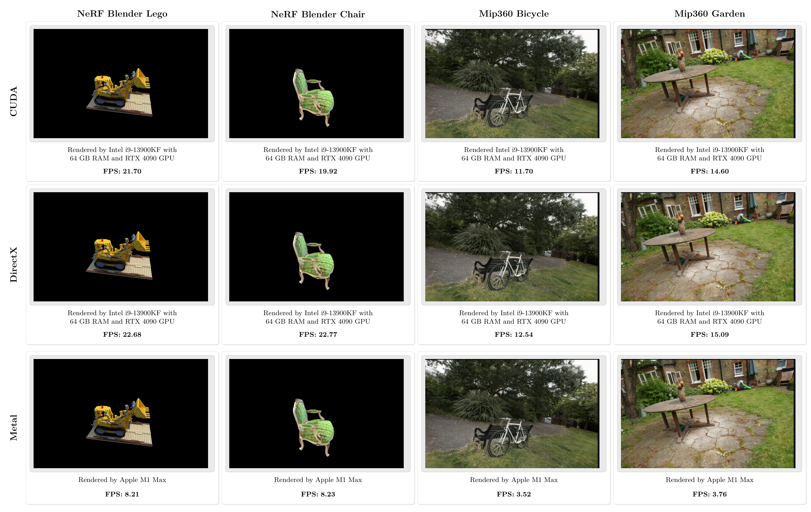

# LuisaComputeGaussianSplatting

## How to start

### Build with XMake

- Generate path envs for [LuisaCompute](https://github.com/LuisaGroup/LuisaCompute)
  - create `.env` file by copy `.env.template` file, and modify the `LC_DIR` and `LC_XREPO_DIR` to the LuisaCompute path on your machine
  - `xmake l setup.lua` to generate `lc_options.generated.lua`
- Build
  - `xmake`
  - `lcgs-app` will be generated in `build/bin/` if successful

### Build with CMake

- Configure the project (CMake will download LuisaCompute for you so you don't need to set up the environment)
  - `cmake -G Ninja -S . -B <build-dir> -D CMAKE_BUILD_TYPE=Release`
- Build
  - `cmake --build <build-dir>`
  - `luisa-gaussian-splatting` will be generated in `<build-dir>/bin/` if successful

### Test

- Get the ply file from Release
  - [mip360_bicycle](https://github.com/LuisaGroup/LuisaComputeGaussianSplatting/releases/download/v0.1/mip360_bicycle_30000.ply)
  - [mip360_garden_30000](https://github.com/LuisaGroup/LuisaComputeGaussianSplatting/releases/download/v0.2/mip360_garden_30000.ply)
  - [nerf_blender_lego](https://github.com/LuisaGroup/LuisaComputeGaussianSplatting/releases/download/v0.1/nerf_blender_lego_30000.ply)
  - [nerf_blender_chair_30000](https://github.com/LuisaGroup/LuisaComputeGaussianSplatting/releases/download/v0.2/nerf_blender_chair_30000.ply)
- Run
  - If you build the project with XMake:
    - `xmake run lcgs-app --ply=<path_to_your_ply> --backend={dx|cuda|metal} --out=<dir_to_your_out_img>`
  - If you build the project with CMake:
    - `<build-dir>/bin/luisa-gaussian-splatting --ply=<path_to_your_ply> --backend={dx|cuda|metal} --out=<dir_to_your_out_img>`
  - an extra optional arg is `--world`, you can choose blender or colmap, the colmap scene has its default up vector (0, -1, 0) and the blender scenes assuming up vector (0, 0, 1). we assume colmap by default.
  - e.g. `xmake run lcgs-app --ply="D:\ws\data\pretrained\gaussian\nerf_blender_chair_30000.ply" --out=D:/ws/data/mid/lcgs/ --backend=dx --world=blender`
  - e.g. `xmake run lcgs-app --ply="D:\ws\data\pretrained\gaussian\mip360_bicycle_30000.ply" --out=D:/ws/data/mid/lcgs/ --backend=dx`
  - then you can check `<dir_to_your_out_img>` with `<ply_name>_<dx/cuda...>.png` for the result, e.g. `mip360_bicycle_30000_dx.png`

### Interactive Display

You can run the app with `--display=true` to enable interactive display. You can use the following controls:
- `WASD` to move the camera
- Drag the mouse with the left button to orient the camera
- Drag the mouse with the right button to rotate the camera around the center
- Tweak the sliders on the GUI panel to adjust the camera move speed, rotation speed, and field of view.

## Result

### lego

### mip360_bicycle

### Multi Backend Compare 

不同后端实现效果对比

## Known Issues

- 当前的camera的初始位置是写死在代码里的，你可以在`app/main.cpp`中找到`pos`和`target`设置你想要的相机位姿，后续会暴露到配置中
- 当前只有前向计算的代码，没有反向
- 并行原语的实现比较粗暴，有提升效率的空间，也可能会有隐藏的bug，需要更多测试

